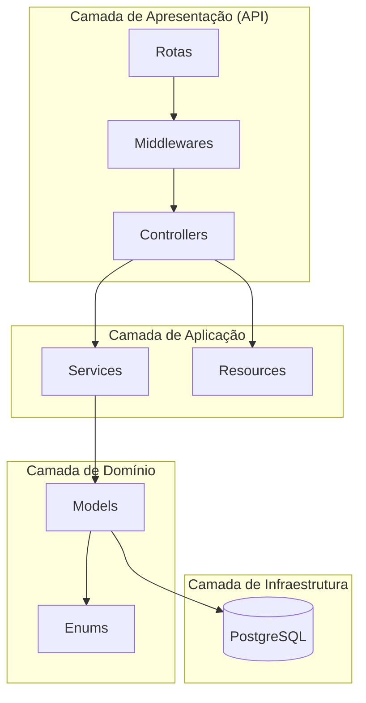
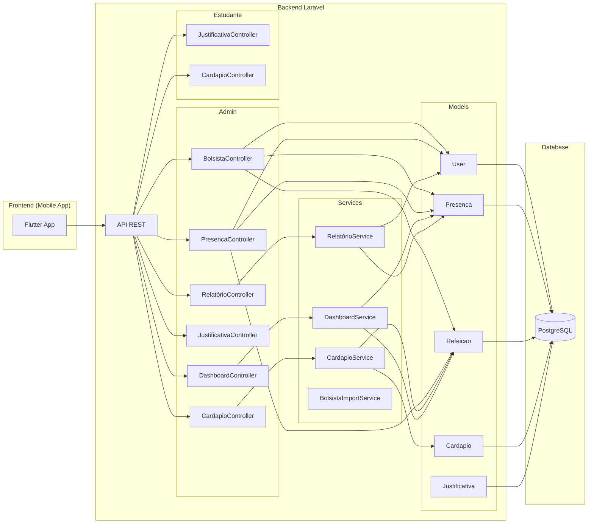

# Avaliação Arquitetural do Projeto RI IFBA

## 1. Estilo Arquitetural

O sistema utiliza uma arquitetura **Monolítica em Camadas (Layered Monolith)** com características de **API RESTful**, seguindo parcialmente o padrão **Service Layer Pattern**.



### Classificação Detalhada

| Aspecto | Classificação |
|---------|---------------|
| **Estilo Geral** | Monolito Modular |
| **Comunicação** | REST API (JSON) |
| **Padrão de Projeto** | MVC Adaptado + Service Layer |
| **Autenticação** | Token-based (Sanctum) |
| **Autorização** | Middleware-based (sem Policies) |

---

## 2. Camadas do Sistema

### 2.1 Controllers (14 arquivos)
Responsáveis por receber requisições HTTP e retornar respostas JSON.

| Controller | Linhas | Responsabilidades |
|------------|--------|-------------------|
| `BolsistaController` | **767** ⚠️ | CRUD, Importação, QR Code, Presença |
| `PresencaController` | **541** ⚠️ | CRUD, Confirmação, Estatísticas |
| `CardapioImportService` | 297 | Importação de planilhas |
| `JustificativaController` | 267 | CRUD, Aprovação |
| `UserController` | 184 | CRUD de usuários |

### 2.2 Services (6 arquivos)
Camada opcional para lógica de negócio complexa.

| Service | Linhas | Responsabilidade |
|---------|--------|------------------|
| `CardapioImportService` | 297 | Parse de Excel/CSV |
| `DashboardService` | 208 | Agregações estatísticas |
| `BolsistaImportService` | 200 | Importação de bolsistas |
| `RelatorioService` | 186 | Geração de relatórios |
| `RelatorioSemanalService` | 185 | Relatórios semanais |
| `CardapioService` | 189 | CRUD de cardápios |

### 2.3 Models (8 arquivos)
Representam as entidades do banco de dados.

- `User` (190 linhas) - Usuários do sistema
- `Presenca` - Registro de presenças
- `Cardapio` - Cardápios diários
- `Refeicao` - Refeições (almoço/jantar)
- `Justificativa` - Justificativas de falta
- `Bolsista` - Bolsistas aprovados
- `FilaExtra` - Fila de espera
- `UsuarioDiaSemana` - Dias permitidos por usuário

### 2.4 Enums (6 arquivos)
Valores fixos do domínio.

- `StatusPresenca`: PRESENTE, FALTA_JUSTIFICADA, FALTA_INJUSTIFICADA
- `StatusJustificativa`: PENDENTE, APROVADA, REJEITADA
- `TurnoRefeicao`: ALMOCO, JANTAR
- `PerfilUsuario`: ADMIN, ESTUDANTE
- `TipoJustificativa`: ANTECIPADA, POSTERIOR
- `StatusFila`: AGUARDANDO, ATENDIDO, CANCELADO

---

## 3. Problemas Identificados (Code Smells)

### 3.1 🔴 Controllers Gigantes (God Controllers)
Os controllers `BolsistaController` (767 linhas) e `PresencaController` (541 linhas) violam o **Princípio de Responsabilidade Única (SRP)**.

**Problema no `BolsistaController`:**
- Mistura CRUD de bolsistas com lógica de presença
- Contém lógica de importação que poderia estar 100% no Service
- Métodos de 100+ linhas (ex: `confirmarPorQrCode`)

### 3.2 🟡 Duplicação de Lógica
Há métodos similares em controllers diferentes:
- `BolsistaController.confirmarPresenca` vs `PresencaController.confirmarPorId`
- `BolsistaController.confirmarPorQrCode` vs `PresencaController.validarPorQrCode`

### 3.3 🟡 Services Subutilizados
Alguns controllers (ex: `PresencaController`) não usam Services, colocando toda a lógica de negócio no próprio controller.

### 3.4 🟡 Falta de Policies
Autorização é feita manualmente nos controllers ou via middleware genérico. Não há controle granular por recurso.

---

## 4. Recomendações de Simplificação

### 4.1 Refatorar `BolsistaController`
Dividir em 3 controllers menores:

```
BolsistaController (CRUD)          ~150 linhas
├── index, show, store, update, destroy

BolsistaPresencaController (Ações) ~200 linhas
├── confirmarPresenca, marcarFalta, confirmarLote

BolsistaQrCodeController (QR)      ~100 linhas
├── confirmarPorQrCode
```

### 4.2 Criar `PresencaService`
Mover a lógica de confirmação de presença do controller para um Service dedicado:

```php
// app/Services/PresencaService.php
class PresencaService {
    public function confirmarPorMatricula(string $matricula, string $turno): Presenca
    public function confirmarPorId(int $userId, int $refeicaoId): Presenca
    public function marcarFalta(int $presencaId, string $tipo): Presenca
}
```

### 4.3 Unificar Rotas Duplicadas
Escolher UM endpoint para confirmação de presença (ex: apenas `/presencas/{userId}/confirmar`) e depreciar os outros.

### 4.4 Extrair Validações Complexas
Mover validações de regras de negócio (ex: "bolsista tem direito neste dia?") para o Model ou para um Service.

---

## 5. Diagrama de Componentes Atual



---

## 6. Resumo Executivo

| Métrica | Valor | Avaliação |
|---------|-------|-----------|
| **Arquitetura** | Monolito Modular | Adequada para o escopo |
| **Maior Controller** | 767 linhas | ⚠️ Muito grande |
| **Uso de Services** | Parcial (6/14) | 🟡 Pode melhorar |
| **Uso de Policies** | Nenhum | 🔴 Recomendado adicionar |
| **Duplicação de Código** | Moderada | 🟡 Unificar endpoints |
| **Complexidade Geral** | Média-Alta | Simplificável |

### Próximos Passos Sugeridos
1. **Curto prazo**: Criar `PresencaService` para centralizar lógica de presença.
2. **Médio prazo**: Dividir `BolsistaController` em controllers menores.
3. **Longo prazo**: Implementar Policies para autorização granular.

