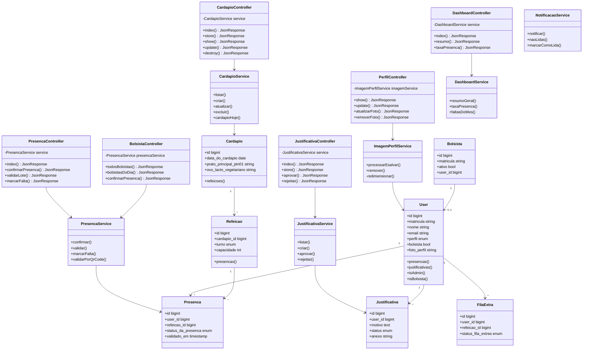

# Diagrama de Classes - RI IFBA

## Visão Geral da Arquitetura

---

## Camadas da Aplicação

| Camada | Responsabilidade |
|--------|------------------|
| **Controllers** | Receber requisições, validar input, retornar JSON |
| **Services** | Lógica de negócio, regras de domínio |
| **Models** | Representação das entidades, relacionamentos |

---

## Services do Sistema

| Service | Responsabilidade |
|---------|------------------|
| `CardapioService` | CRUD de cardápios |
| `PresencaService` | Controle de presenças |
| `JustificativaService` | Fluxo de justificativas |
| `DashboardService` | Métricas e estatísticas |
| `ImagemPerfilService` | Upload de fotos |
| `NotificacaoService` | Notificações |
| `UserService` | Gerenciamento de usuários |
| `RelatorioService` | Geração de relatórios |
